# magtrack

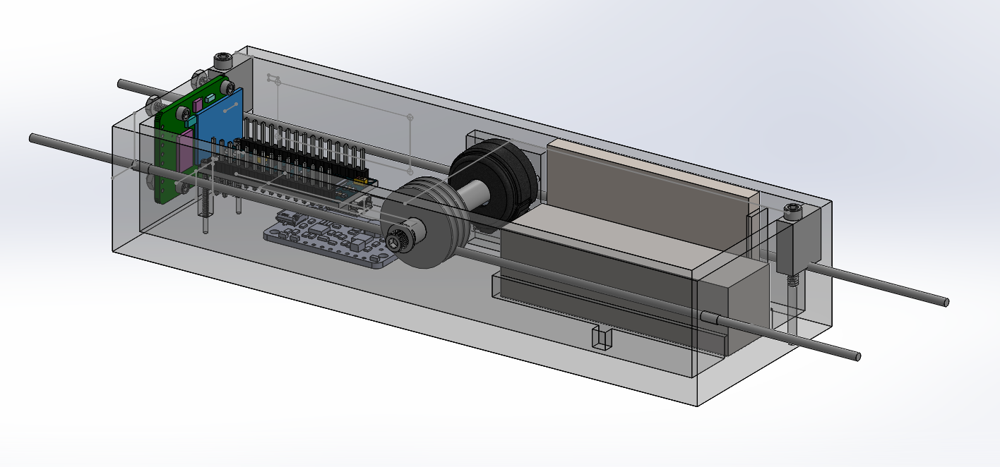

Magtrack is a device I built to characterize mu-metal magnetic shielding being built around a new atom interferometer at Stanford University.

## Background

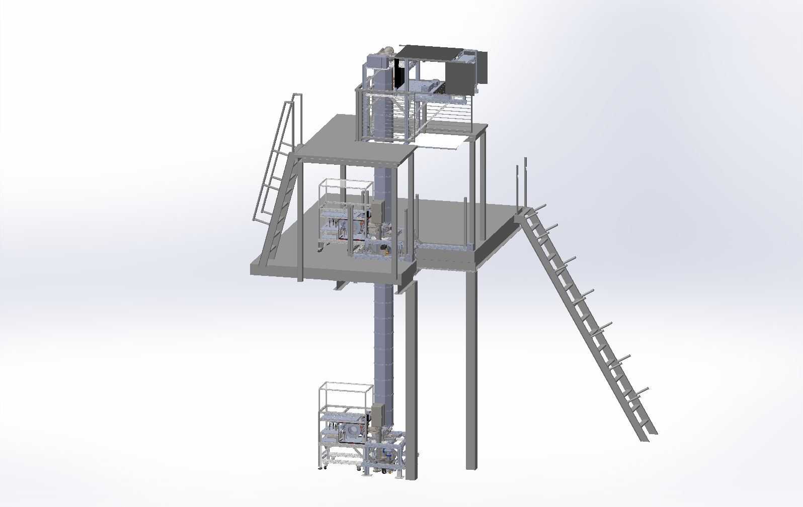

This summer I have had the amazing opportunity to work in Jason Hogan’s lab and join their effort to build a 10-meter atom interferometer, which will be used to search for ultralight dark matter, test quantum mechanics in new regimes, and detect gravitational waves. 

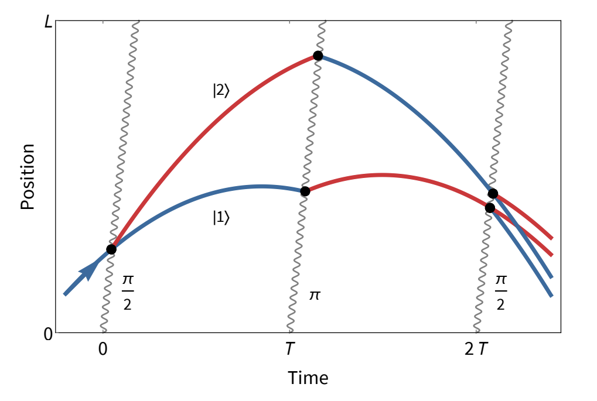

An atom interferometer is a device that uses lasers to split and recombine matter waves, taking advantage of the fact that atoms behave like waves at the quantum level. Interactions with particles of dark matter or gravitational waves can be detected by measuring the interference of these matter waves as they are recombined, hence the term interferometer.

## My project

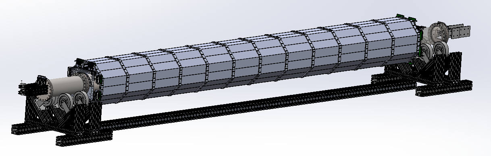

The interferometer being built at Stanford consists of a 10-meter long vacuum tube in which atoms are launched into free fall and we fire laser pulses at them.

While the atoms are in free fall, it is crucial that we have fine-grained control over the magnetic field inside the tube. So, it is important that we block the Earth’s natural magnetic field as much as possible. To do so, the lab has designed (and will soon build) magnetic shielding around the tube using a special material called mu-metal. 

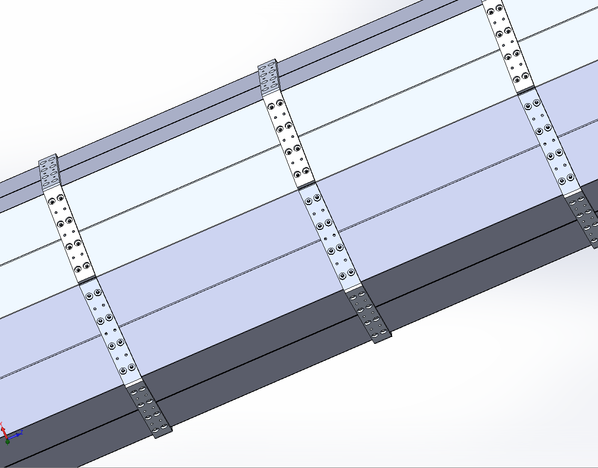

The shielding that the lab designed is unique in that it is not one big solid piece of mu-metal, but instead made of a bunch of little tiles bolted together as shown. During construction of the magnetic shielding, there may be some imperfections. For example, one of these tiles might not get fully bolted down, or there may be a gap between them. These imperfections can cause magnetic field to “leak” into the tube, which we don’t want. In order to diagnose and fix these possible leaks, we need a device that can travel along the middle of the tube and measure the magnetic field at regular intervals. If there is a sudden spike in the field strength in our data, we want to know at what position and angle the field came from so that we know which tiles to adjust. Also, this shield is the same design that will be used for a future, longer interferometer ([MAGIS-100](https://news.fnal.gov/2019/09/magis-100-atoms-in-free-fall-to-probe-dark-matter-gravity-and-quantum-science/)), so it’s critical that we prove that it works here at Stanford.

My main project this summer has been to design and build a device which will travel along the center of the tube, measuring the magnetic field at each position along its length, in order to ensure that the shielding is working as intended. I call this device Magtrack.

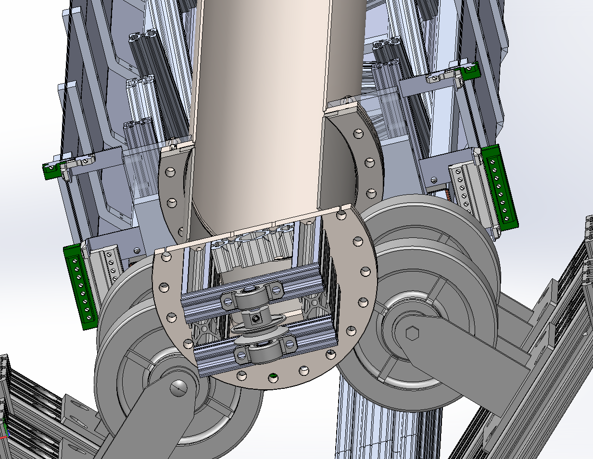

Two pulleys will be mounted on either end of the tube. A nylon cable will be stretched between them, and a crank at one end will allow the pulleys to turn, which turns the nylon cable into a sort of conveyor belt running along the center of the tube. Magtrack will grab onto this conveyer belt and be pulled through the tube to take its measurements.

To make such a device, you need several electronic components and sensors to make these measurements, and you need a housing or container that you can mount the electronics in.

## Electronics

My first job was to find the right electronic components for Magtrack and figure out how they would all work together to measure and store the data. 

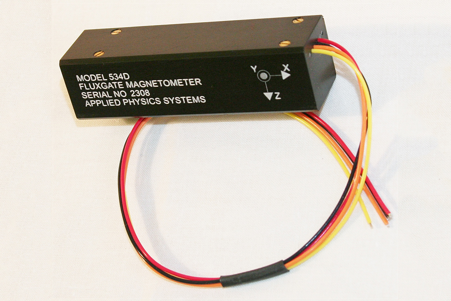

The first thing you’ll need is a magnetometer, and I found one that could measure the field strength along the X, Y and Z-axes. 

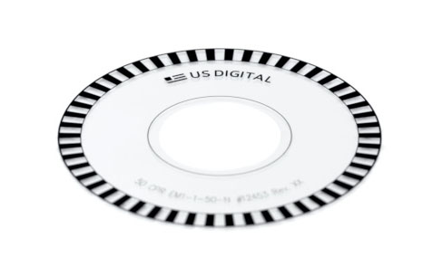

The next thing you’ll need is a way to measure the current position of the device along the tube. The solution is something called an encoder wheel, which is turned by the nylon cable as Magtrack moves along it. The wheel has many tiny slits which allow it to repeatedly block and unblock a beam of light. Every time the light is blocked, we will have moved a certain distance along the nylon cable. 

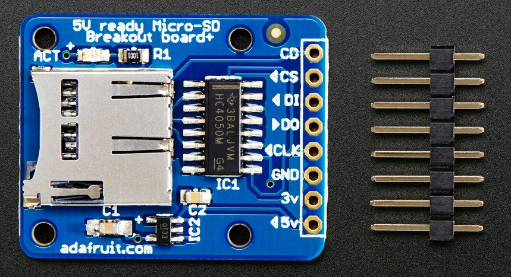

Next, you’ll need something to store the data on, which an SD card breakout board works great for.

The brains of the whole operation is an Arduino Nano, which tells the magnetometer to take a measurement after each tick of the encoder wheel and writes the data to the SD card.

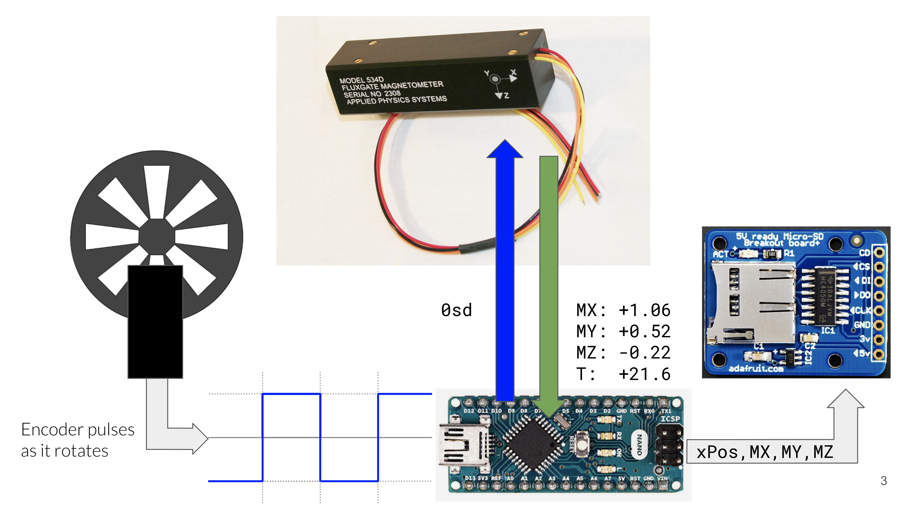

Every time the encoder wheel moves, we can detect the change in voltage using the Arduino. Then, we can send an ASCII command to the magnetometer over serial to get the magnetic field measurements. Then, we can record our position and field measurements on the SD card.

## Housing

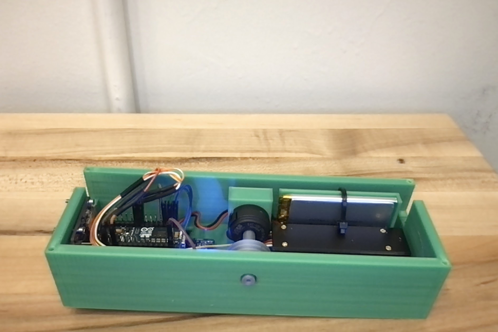

Along with electronics, I learned a ton about 3d modeling and printing this summer. Designing a housing is hard no matter what, especially for electronics. The housing for Magtrack was especially hard to design. The whole thing is going to be riding through a very narrow vacuum tube on a nylon cable. In order to avoid damaging or contaminating the tube, the device must not come in contact with its inner walls. For this reason it also can’t be too heavy, as we must avoid the nylon cable sagging down too much. So, we decided to make it out of 3d printed plastic, which is light, but also meant I had to ensure that the housing was 3d-printable. 

## Conclusion

This summer has been such an awesome experience because I got to do so many things I had zero experience with, and I got to learn a ton about physics, and life in general, from the amazing people in the Hogan Group. Special thanks to Professor Hogan and PhD student Yijun, who have both been an incredible help.
